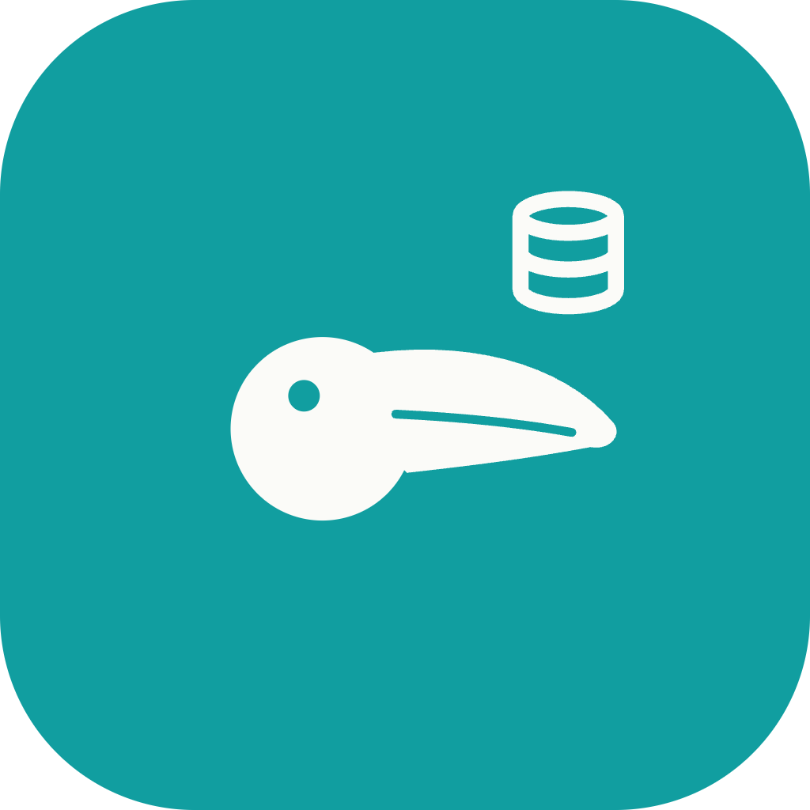

# Tucano DB

Open source MongoDB GUI — desktop app built with Tauri 2 + React.
A fast, native alternative to Compass / Studio 3T / NoSQLBooster, running on macOS (Apple Silicon + Intel), Windows and Linux.

<p align="center">
  
</p>

## Features

**Connect & browse**

- Multiple simultaneous server connections, each with its own color tag
- Connect via connection string (`mongodb://` / `mongodb+srv://`) — strings never leave the Rust backend
- DataGrip-style database picker: choose exactly which databases to show per server
- Tree sidebar: server → databases → collections, with live document counts and on-disk sizes
- Per-collection indexes browser and change-history indicator

**Query**

- NoSQLBooster-style editor with two languages:
  - **Mongo shell** (`db.coll.find(...)`, `aggregate`, `count`, `findOne`)
  - **SQL** (`SELECT ... WHERE ...`) auto-translated to a Mongo query for non-experts
- Strong autocomplete for fields and operators, CodeMirror 6 syntax highlighting
- Context-separated **query tabs** — one connection/collection per tab
- Saved queries panel + full query history across the database

**Inspect & edit**

- Three views per result set: **Tree**, **Table**, **JSON**
- Colored BSON types (`ObjectId`, `Date`, `Int32`, `Long`, `Decimal128`, …) with full Extended JSON fidelity
- Table view: sticky row index, resizable columns, click-to-sort, type labels in the header, hover an `ObjectId` to see its embedded date
- Full CRUD: insert / edit / duplicate / delete documents (with confirmation)
- Collection actions: create / rename / drop / duplicate-with-rename, create / drop indexes
- Copy key, value, or both — and copy the whole document

**Safety & analytics**

- Studio-3T-style **history / backup**: pre-update and pre-delete states are recorded locally (SQLite) and can be restored
- Server **Overview** dashboard: version, uptime, connections, op counters, memory, network, data/storage size, databases by size
- Filtered count + grand total on every result set, with pagination

**App**

- Dark / Light / System theme — teal brand accent (`#119EA0`, `oklch(0.62 0.115 205)`) on a deep `#0F1014` canvas
- Localized in English, Português (Brasil) and Español (technical terms like Run / ObjectId / BSON type names stay in English)
- Configurable timezone & date format, default page size, CSV / XLSX / JSON export
- Optional auto-execute on collection click + customizable initial script
- **MCP server** — expose your running instance to Claude (Desktop / Code), OpenCode and Codex
- In-app auto-updater (signed releases via GitHub)

## Downloads

Get the latest installer from **[Releases](https://github.com/plscabral/tucano-db/releases/latest)**:

- **macOS (Apple Silicon)** — `Tucano.DB_*_aarch64.dmg`
- **macOS (Intel)** — `Tucano.DB_*_x64.dmg`
- **Windows** — `Tucano.DB_*_x64-setup.exe` or `.msi`
- **Linux** — `Tucano.DB_*_amd64.AppImage` or `.deb`

### First-launch warnings

The app is currently **not code-signed**, so the OS will warn you the first time you open it.

**macOS** — after dragging to `/Applications`, do one of:

- Right-click the app → **Open** → **Open** in the dialog, or
- *System Settings → Privacy & Security → "Open Anyway"*.

> If you ever see *"is damaged and can't be opened"*, run once:
> `xattr -cr "/Applications/Tucano DB.app"`

**Windows** — SmartScreen will say "Windows protected your PC". Click **More info → Run anyway**.

## Stack

| Layer    | Tech |
|----------|------|
| Shell    | Tauri 2 (Rust) |
| Driver   | `mongodb` crate (async, tokio) + `bson` |
| Storage  | SQLite (rusqlite, bundled) — local history/backup |
| MCP      | Axum bridge + Node MCP server (`packages/tucano-db-mcp`) |
| UI       | React + Vite + Tailwind CSS (shadcn/ui) |
| Editors  | CodeMirror 6 |
| Export   | rust_xlsxwriter, csv |

## Getting started

Requirements: Node 20+, pnpm, Rust stable (`rustup`), Tauri prerequisites (https://v2.tauri.app/start/prerequisites/).

```bash
pnpm install
pnpm tauri dev
```

Build native bundles:

```bash
pnpm tauri build                     # current target
pnpm tauri build --target aarch64-apple-darwin
pnpm tauri build --target x86_64-apple-darwin
pnpm tauri build --target x86_64-pc-windows-msvc
```

## How it works

1. Add a connection with a color tag and connect — the Rust backend opens the `mongodb` client; the connection string is never exposed to the frontend.
2. Pick which databases to show (DataGrip-style), then expand a collection in the sidebar to see counts, sizes, indexes and change history.
3. Open a query tab — write in **Mongo shell** or **SQL** with autocomplete — and run with <kbd>⌘</kbd> <kbd>↵</kbd>.
4. Inspect results in Tree / Table / JSON, edit documents inline (pre-change state is backed up locally), and restore from history if needed.

## Shortcuts

| Action | Shortcut |
|---|---|
| Run the active query | <kbd>⌘</kbd> <kbd>↵</kbd> |
| Re-run / refresh the active query | <kbd>⌘</kbd> <kbd>R</kbd> |
| Save current query | <kbd>⌘</kbd> <kbd>S</kbd> |
| Accept autocomplete | <kbd>Tab</kbd> |
| Document / collection actions | Right click |
| Settings | <kbd>⌘</kbd> <kbd>,</kbd> |
| Close dialog | <kbd>Esc</kbd> |

Use <kbd>Ctrl</kbd> in place of <kbd>⌘</kbd> on Linux / Windows. The full list lives under **Settings → Keyboard shortcuts**.

## MCP

Tucano DB ships an MCP server so AI agents can read your running instance. Enable it under **Settings → MCP** (it starts an Axum bridge on `127.0.0.1` with a bearer token) and one-click install into **Claude Desktop**, **Claude Code**, **OpenCode** or **Codex**.

Tools exposed: `list_connections`, `list_databases`, `list_collections`, `find`, `overview`.

## Author

Created and maintained by **[Paulo Cabral](https://github.com/plscabral)**.

If you fork, build on, or redistribute Tucano DB, please keep the copyright
notice in `LICENSE` intact — it's the only thing the MIT license asks of you.

## License

[MIT](./LICENSE) © 2026 Paulo Cabral.
